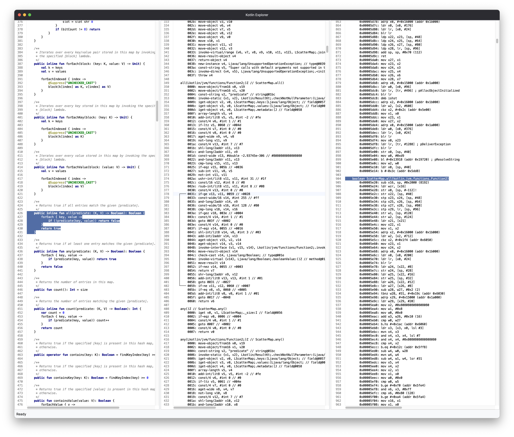

# Kotlin Explorer

Kotlin Explorer is a desktop tool to quickly and easily disassemble Kotlin code into:
- Android DEX bytecode
- Android OAT assembly

After launching Kotlin Explorer, type valid Kotlin code in the left pane, then click
*File > Decompile* or use `Cmd-Shift-D` on macOS, `Ctrl-Shift-D` on Linux and Windows.

The middle pane will show the Android DEX bytecode, and the right panel
the native assembly resulting from ahead of time compilation (AOT).

# Running Kotlin Explorer

Kotlin Explorer currently relies on 2 environment variables described below.

Kotlin explorer also requires `java` and `javap` to be in your `$PATH`. To display
Android DEX bytecode and OAT assembly, you also need `adb` in your `$PATH`.

> [!IMPORTANT]  
> DEX bytecode and OAT assembly will only be displayed if you have an Android
> device connected that can be successfully reached via adb.

### `$ANDROID_HOME`

Must point at your Android SDK installation (the folder containing `build-tools/`,
`platform-tools/`, etc.)

### `$KOTLIN_HOME`

Must point at a Kotlin installation (the folder containing `bin/kotlinc` and
`lib/kotlin-stdlib.jar`).

On macOS, an easy way to install Kotlin is to use Homebrew (`brew install kotlin`)
and to set `$KOTLIN_HOME` to `/opt/homebrew/Cellar/kotlin/1.9.0/libexec` (change
the version number appropriately).

Future updates will allow to select those directories from the UI. 

# License

Please see [LICENSE](./LICENSE).
